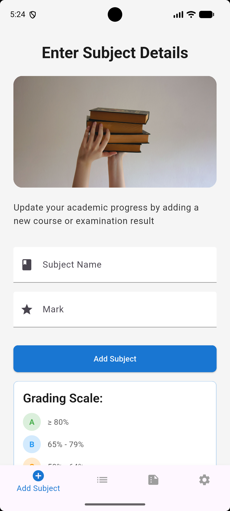
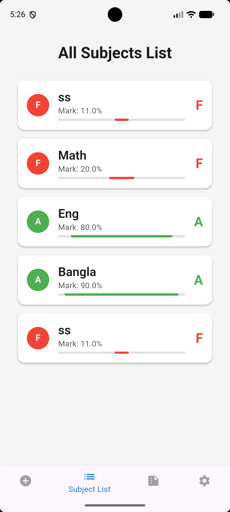
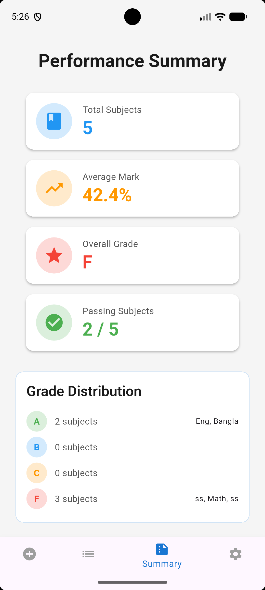
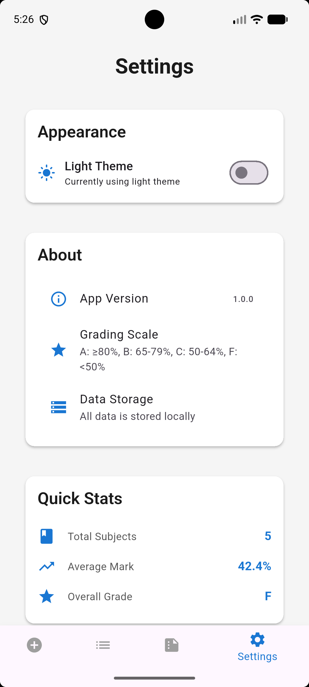
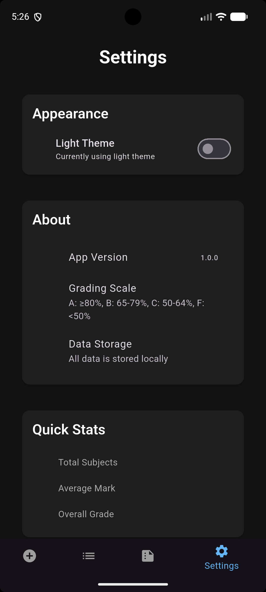
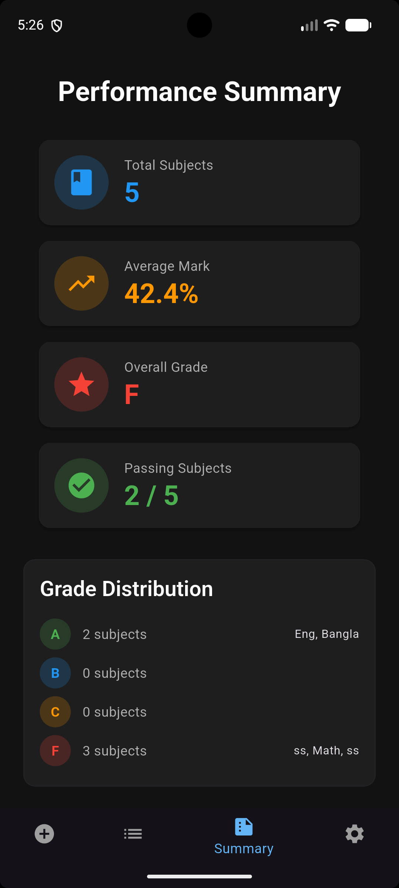
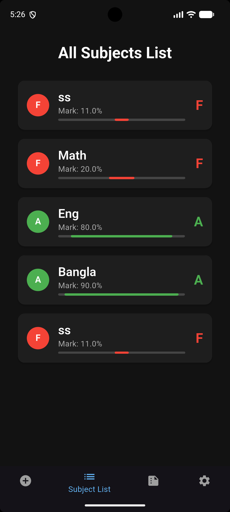
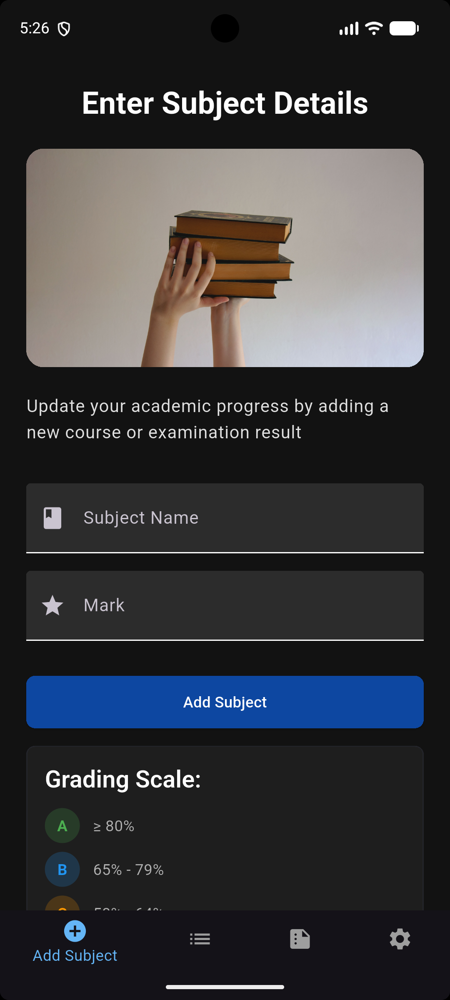

# 📚 Student Grade Tracker

A comprehensive Flutter application that helps students track their academic performance by managing subjects, marks, and grades with real-time statistics and a beautiful dark/light theme interface.


---

## 📱 Screenshots

All screenshots are stored in `assets/ss`.

| Screenshot 1 | Screenshot 2 | Screenshot 3 | Screenshot 4 |
|--------------|--------------|--------------|--------------|
|  |  |  |  |

| Screenshot 5 | Screenshot 6 | Screenshot 7 | Screenshot 8 |
|--------------|--------------|--------------|--------------|
|  |  |  |  |

---

## ✨ Features

### 🎯 Core Features
- **Add Subjects**: Input subject names and marks with real-time validation
- **Subject List**: View all subjects with their grades and marks
- **Swipe to Delete**: Remove subjects with a simple swipe gesture
- **Summary Dashboard**: See overall performance statistics at a glance

### 📊 Academic Features
- **Grade Calculation**: Automatic grade assignment based on marks:
  - A: ≥ 80%
  - B: 65% - 79%
  - C: 50% - 64%
  - F: < 50%
- **Performance Metrics**:
  - Total subjects count
  - Average mark
  - Overall grade
  - Number of passing subjects
  - Grade distribution breakdown

### 🎨 User Experience
- **Light/Dark Theme**: Toggle between themes with a single tap
- **Responsive Design**: Works on both phones and tablets
- **Validation**: Form validation with clear error messages
- **Visual Feedback**: Snackbar notifications for actions
- **Grade Visualization**: Color-coded grades and progress bars

### 🏗️ Technical Features
- **State Management**: Provider pattern for reactive updates
- **Clean Architecture**: Separation of concerns with models, providers, and screens
- **Reusable Components**: Custom widgets for grade chips and cards
- **Theme-Based Styling**: Colors are managed through `ThemeData`

---

## 🚀 Getting Started

### Prerequisites
- Flutter SDK 3.0 or higher
- Android Studio or VS Code
- Android Emulator, iOS Simulator, or physical device

### Installation

1. **Clone the repository**
   ```bash
   git clone https://github.com/yourusername/student-grade-tracker.git
   cd student-grade-tracker
   ```

2. **Install dependencies**
   ```bash
   flutter pub get
   ```

3. **Run the app**
   ```bash
   flutter run
   ```
